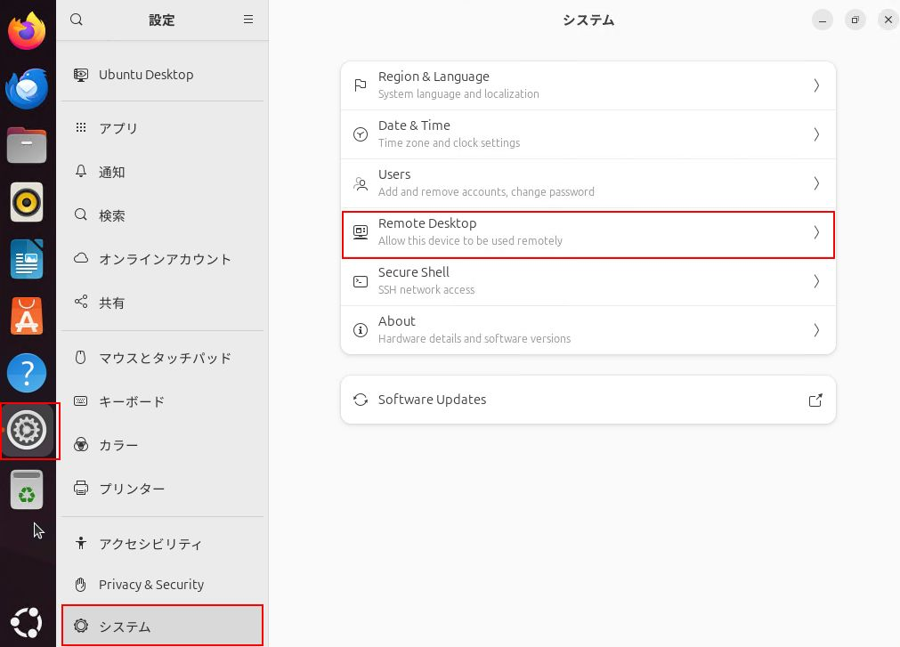
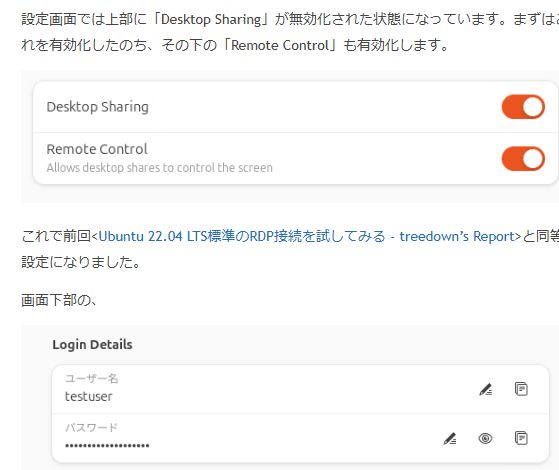
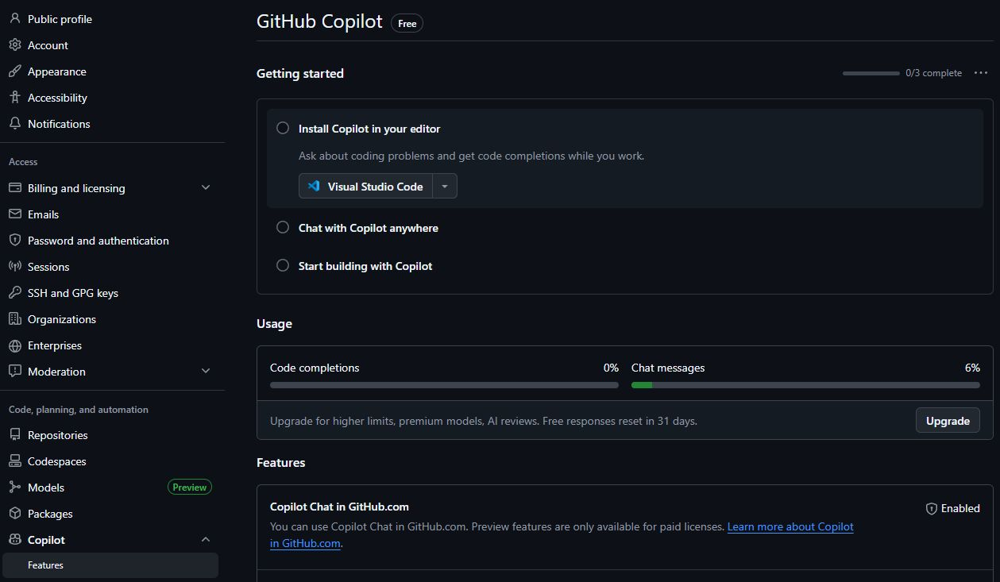

# Ubuntu2404_public
Ubuntu24.04の公開用リポジトリ

**作成日**  : 2026/03/29
**ﾊﾞｰｼﾞｮﾝ** : v0.0.3

---

# Git操作

## user.name、user.email設定

Terminalから以下で設定
[Gitでコミットしようとしたら、'user.name' と 'user.email' の設定が必要](https://qiita.com/dopodomani/items/e2bdca5446b836f434d1)
```command prompt
git config --global user.name "Your Name"
git config --global user.email "your.email@example.com"
```

---

# ubuntu 24.04 基本設定

## Remote DeskTop

[Ubuntu 24.04 LTSで新しい標準RDP接続を試してみる](https://blog.treedown.net/entry/2024/09/17/010000)  
以下の設定で、WindowsからRemote Desktopでログインできるように設定

- 設定画面 > システム > 画面上の「Remote Desktop」> Desktop Sharing、Remote Controlの二つを有効化
  - 

- ユーザ名とパスワードを確認。パスワードはRDP接続用のパスワードを別途設定
  - 

## openssh-server

サーバーでの事前準備
[SSH接続のための設定まとめ](https://qiita.com/010Ri/items/0a09356633655b5613ee)  
以下のコマンドで、sshサーバーをインストール

```bash
sudo apt install openssh-server
```

## jq

[JSONをLinuxで扱うコマンドの使い方](https://zenn.dev/en2enzo2/articles/e45e6d0aec6c7e)
[jqコマンドを使ったJSONデータの加工](https://yossi-note.com/how_to_use_the_jq_command/)
[jq コマンドを使う日常のご紹介](https://qiita.com/takeshinoda@github/items/2dec7a72930ec1f658af)

ファイルを見やすく表示
```bash
jq '.' data.json
```

色付け・整形して表示（-Cオプション）:
```bash
jq -C '.' data.json | less -R
```

## du

[Linuxでディレクトリサイズを確認する方法](https://go.lightnode.com/ja/tech/check-directory-size-in-linux)
ubuntu上でフォルダ容量確認する場合

```bash
du -h
```

---

# Github Copilot設定

## Visual Studio Code から GitHub Copilot を利用

[参考_GitHub Copilot を極める会
](https://zenn.dev/microsoft/articles/github_copilot_advanced)

基本的には、VSCodeをインストールし、Github copilot chatのExtentionを入れた後に、Githubへログインするだけ

## Github Copilotのプラン確認

自分のGithub repositoryにログインし、
右上アイコン > Settings > Copilotで確認


## GitHub Copilotの料金プラン

[参考_GitHub Copilotを導入するには？](https://biz.moneyforward.com/ai/basic/807/)
| プラン名 | 月額料金（1ユーザーあたり） | 主な対象者 | 特徴 |
|---------|--------------------------|----------|-----|
| Copilot Free | 無料 | 個人（組織管理下でないアカウント） | 基本的なコード補完とチャット機能（月あたり「2,000 コード補完」「50 プレミアムリクエスト」の制限あり） |
| Pro | $10（または年額 $100） | 個人開発者 | 無制限コード補完＋高度モデル利用。 |
| Copilot Pro＋ | $39（または年額 $390） | 個人でモデル選択重視 | 全モデルアクセス、より「プレミアムリクエスト数」多め。 |

---

# dockerメモ

## dockerコマンド

| コマンド | 説明 | 備考 |
| --- | --- | --- |
| docker run | 実行 | イメージからコンテナ生成など |
| docker exec | アタッチ | 実行中のコンテナにアタッチ。-itでターミナル実行 <BR> docker exec -it [コンテナ名] bash |
| docker stop | 停止 | 例: docker stop ollama |
| docker start | 開始 | 例: docker start ollama |
| docker rm | コンテナ削除 | 例: docker rm ollama |
| docker rmi | イメージ削除 | 例: docker rmi イメージ |
| docker ps | プロセス確認 | 例: docker ps -a |
| docker images | イメージ確認 | |

### コンテナにアタッチしてbashを使用する場合

docker exec -it [コンテナ名] bash

## dockerオプション

[[Docker]覚えておきたいオプションまとめ](https://qiita.com/ryoishizawa/items/637d39574026bbd54dbf)

| オプション | 説明 | 備考 |
| --- | --- | --- |
| -p  | ポート設定   | {ホスト_ポート番号} : {コンテナ_ポート番号} |
| -v  | フォルダ設定 | {ホスト_フォルダ名} : {コンテナ_フォルダ名} |
| -t  | 標準入力     | ターミナルでの操作 |
| -it | 継続+標準入力 | ターミナルでの操作を継続 |
| --name | コンテナ名 | 指定しないとランダムな乱数に |
| -d | コンテナをバックグランド実行 | --detachの省略。|

---

# ollama設定 

## ollama共通設定

## ollama docker設定

### 1. docker実行

[参考1_Dockerを用いたOllamaの実行手順まとめ](https://qiita.com/Chi_corp_123/items/7b3e2617e901a656ede4)
[参考2_Docker 上で GPU を使って Ollama を動かす](https://ishikawa-pro.hatenablog.com/entry/2025/01/16/192126)

#### 1-1. 基本実行

<details>
  <summary>フォルダマウントの注意をクリックで展開</summary>

```text
Dockerコマンドで -v ollama:/root/.ollama と指定した場合、
「名前付きボリューム（Named Volume）」として扱われるため、
ホスト側のカレントディレクトリ（今いるフォルダ）にデータは現れません。 

フォルダが見当たらない主な理由と、解決策を整理しました。
1. なぜフォルダが見えないのか？
名前付きボリュームの仕組み: ollama: のようにコロンの左側に
絶対パス（/から始まるパス）を書かない場合、Dockerが管理する専用領域にデータが保存されます。

保存場所: 通常、Linux環境では /var/lib/docker/volumes/ollama/_data に保存されています。ここは管理者権限がないとアクセスできません。

2. ホスト側のフォルダで見えるようにする方法（バインドマウント）
自分の好きなフォルダ（例：デスクトップや作業用ディレクトリ）の中身を見たい場合は、
絶対パスで指定する必要があります。

実行コマンド例（Linux / Mac）
カレントディレクトリの ollama_data フォルダを同期させる場合：

bash
docker run -d -v $(pwd)/ollama_data:/root/.ollama ollama/ollama
```

</details>

<BR>

基本実行は以下。　　
ollamaのイメージを取得、 .ollamaフォルダをマウント、ollamaのコンテナ名で実行
初回はイメージ取得で3.5GB程度使用

```bash
# docker 基本起動
docker run -d -v ollama:/root/.ollama -p 11434:11434 --name ollama ollama/ollama
```

#### 1-2. GPUバックグランド実行

GPUでバックグラウンド動作
```bash
# docker 基本起動(GPU)
docker run -d --gpus=all -v ollama:/root/.ollama -p 11434:11434 --name ollama ollama/ollama
```

GPUでバックグラウンド動作(home環境にバインド)
```bash
# docker 基本起動(GPU) home環境にバインド
docker run -d --gpus=all -v $(pwd)/ollama:/root/.ollama -p 11434:11434 --name ollama ollama/ollama
```

start_ollama.shの例(chmod +xで実行権限を与えておく)
```bash
#!/bin/bash

# docker 基本起動(GPU) home環境にバインド
docker run -d --gpus=all -v $(pwd)/ollama:/root/.ollama -p 11434:11434 --name ollama ollama/ollama
```

#### 1-3. 動作確認

curlを使い、以下のコマンドで確認可能

```bash
# curlコマンドで動作確認
curl http://localhost:11434
```

```bash
# curlコマンドで動作確認
curl http://192.168.1.61:11434
```

正常動作の場合、以下のメッセージを取得
```bash
Ollama is running
```

### 1-4. モデルインストール

#### 1-4-1. モデル確認

モデル確認は以下のURLを参考
https://ollama.com/library

#### 1-4-2. モデルインストール

docker実行例:
```bash
docker exec -it ollama ollama pull qwen3.5:9b
```

```bash
docker exec -it ollama ollama pull gpt-oss:20b
```

#### 1-4-3. インストールモデル確認

docker実行例:
```bash
docker exec -it ollama ollama list
```

curl確認
```curl
# curlでインストールモデルを確認
curl http://localhost:11434/api/tags
```

curl確認 (IP)
```curl
# curlでインストールモデルを確認
curl http://192.168.1.61:11434/api/tags
```

実行中のモデル curl確認 (IP)
```curl
# curlでインストールモデルを確認
curl http://192.168.1.61:11434/api/ps
```


bashでcurl出力をjqで成形
```bash
# bashでjqを用いて成形
curl http://localhost:11434/api/tags | jq -C '.'
```

### 1.5 ollamaの推論

#### 1.5.1 ollamaの推論(curl)
コマンドライン(curl)で実行

```curl
curl http://localhost:11434/api/chat -d '{
  "model": "qwen3.5:9b",
  "messages": [{
    "role": "user",
    "content": "日本語で挨拶して"
  }],
  "stream": false
}' | jq -C
```

<BR>
ollama出力をjsonファイルに保存

```curl
curl http://localhost:11434/api/chat -d '{
  "model": "qwen3.5:9b",
  "messages": [{
    "role": "user",
    "content": "日本語で挨拶して"
  }],
  "stream": false
}' > ollama_res.json
```

ollama出力をjsonファイルに保存　(qwen3 no-thinking)
[extra_bodyでno_thinking](https://github.com/run-llama/llama_index/issues/18635#issuecomment-3686160674)

```curl
curl http://localhost:11434/api/chat -d '{
  "model": "qwen3.5:9b",
  "messages": [{
    "role": "user",
    "content": "日本語で挨拶して"
  }],
  "extra_body": {
    "chat_template_kwargs": {"enable_thinking": false}
  },
  "stream": false
}' > ollama_res_nothinking.json
```

jqでollama出力を解析
```
cat ollama_res.json | jq '.message.content'
```

<BR>

#### 1.5.2 ollamaの推論(terminal)

軽いモデルをダウンロードして起き
```bash
ollama pull gemma3:1b
```

teminal上で実行
```bash
ollama run gemma3:1b
```

実行結果は以下
```bash
>>> 挨拶して
こんにちは！何かお手伝いできることはありますか？ 😊
```

## ollama API (日本語)

[Ollama API (日本語)](https://ollama-jp.apidog.io/)


---

# windows11設定

## curlインストール

[curl | Windows11におけるcurl利用までのフロー](https://shelokuma.com/2024/03/20/flow-for-using-command-line-tool-curl-on-windows11/)

step1: [cURL](https://curl.se/) > Download > [Windows downloads](https://curl.se/windows/) > curl for X64 を入手
step2: zipを解凍し、bin/curl.exeをローカルにコピー後、環境変数のpathに追加

```bash
# .binフォルダにcurl.exeを入れた場合のpath追加
C:\Users\$USER\.bin
```

# other
