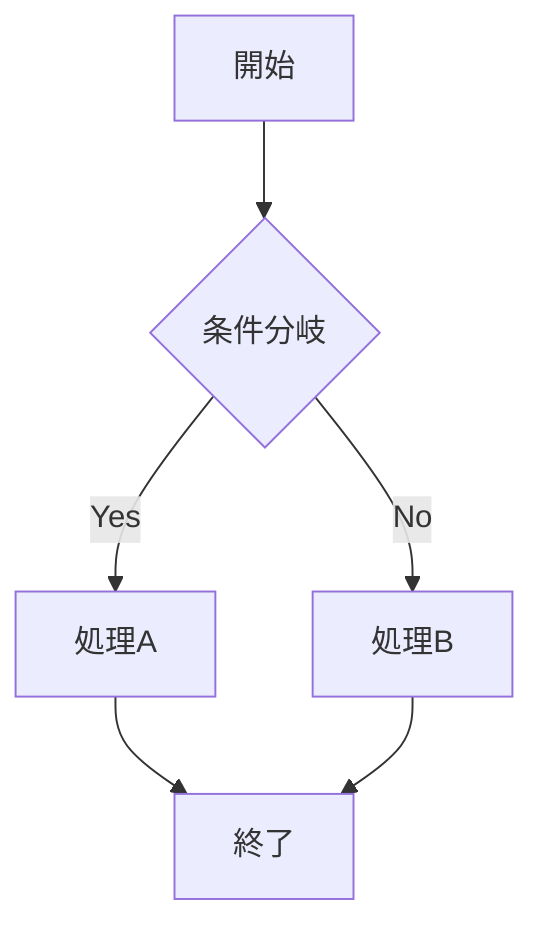
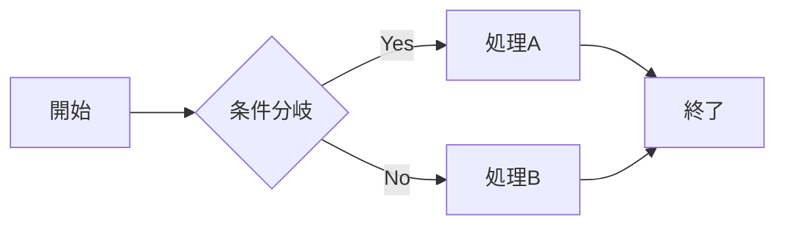
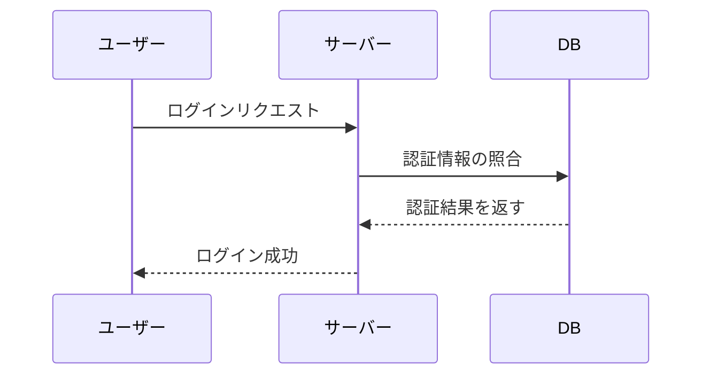
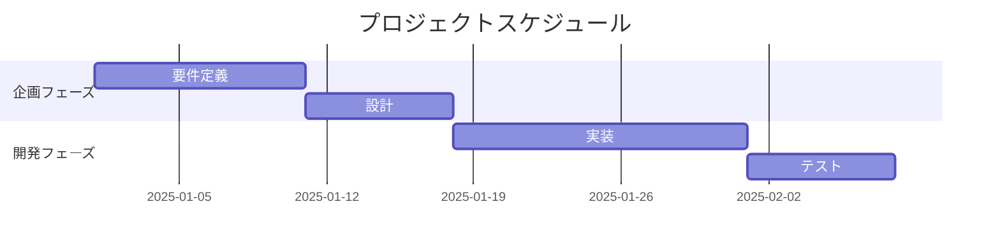
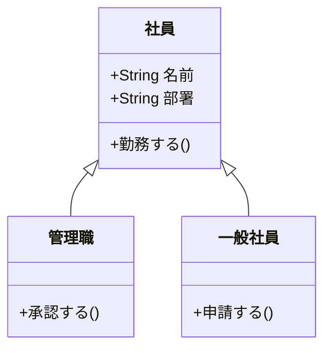
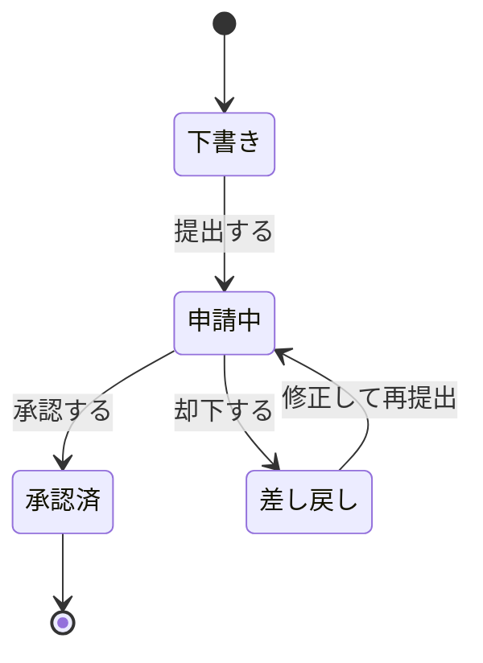
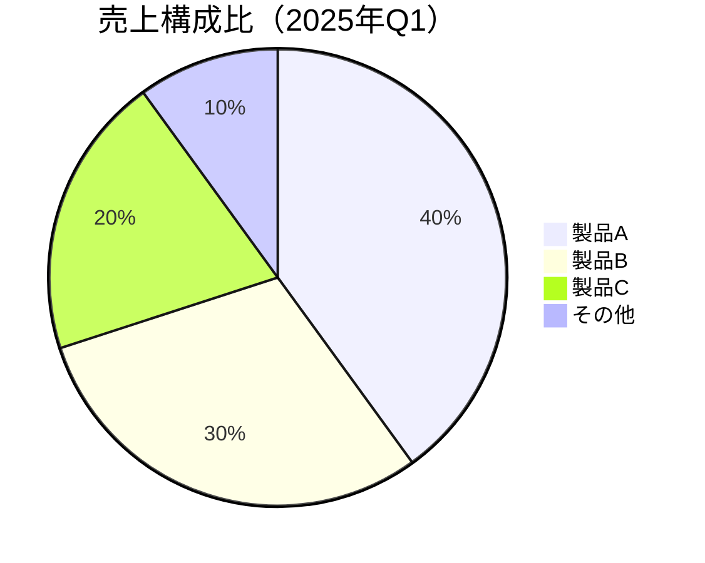
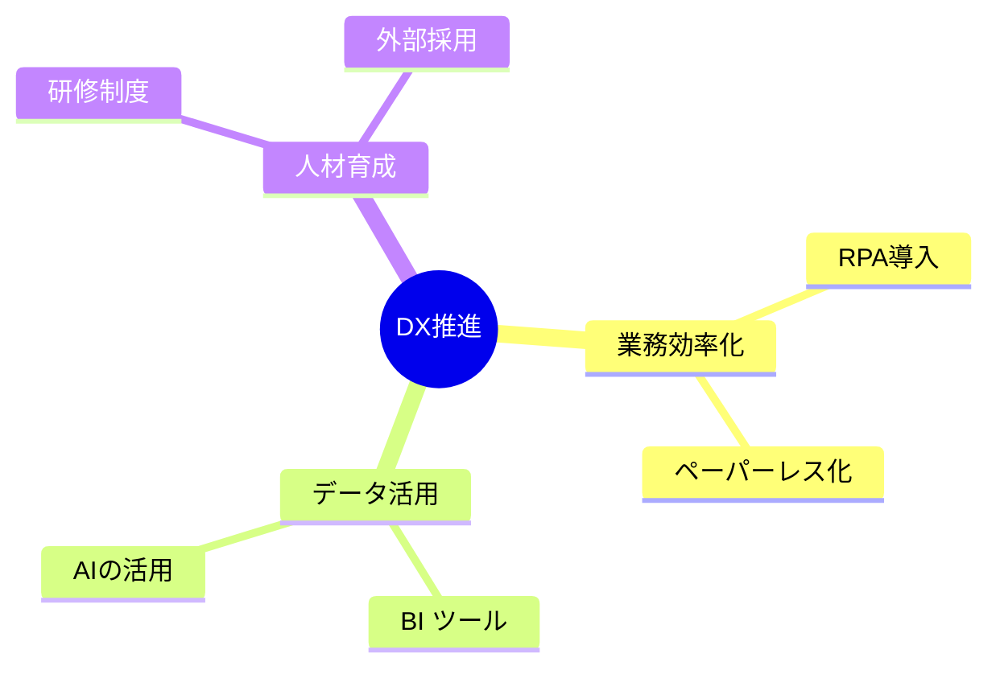

# Mermaid.md

**作成者**: gogo5nta  
**作成日**: 2026-06-24  
**目的**: Mermaidで表現可能なMarkdownを整理
**バージョン**: v0.2  
**参考資料**:

| # | 資料名 | 備考 | URL |
|---|---|---|---|
| 1 | Mermaidで描ける図の種類と活用ガイド | Markdown × Mermaid | [URL](./Mermaidで描ける図の種類と活用ガイド_260624.md) |
| 2 | PlantUMLで描ける図の種類と活用ガイド | Markdown × PlantUML | [URL](./PlantUMLで描ける図の種類と活用ガイド_260624.md)

ベースファイル:
Mermaidで描ける図の種類と活用ガイド_260624.md

---

# 0.概要

MermaidはMarkdown内に記述できるダイアグラム生成ツールです。  
テキストベースのコードで様々な図を作成できます。  
以下、図の種類・用途・コード例 一覧で説明

---

# 1.フローチャート（Flowchart）

可視化できる情報： 業務フロー、処理の分岐、意思決定プロセス

縦書き（TD）コード例：


図の出力：
```text
flowchart TD
    A[開始] --> B{条件分岐}
    B -- Yes --> C[処理A]
    B -- No --> D[処理B]
    C --> E[終了]
    D --> E
```

横書き（LR）コード例：


図の出力：
```text
flowchart LR
    A[開始] --> B{条件分岐}
    B -- Yes --> C[処理A]
    B -- No --> D[処理B]
    C --> E[終了]
    D --> E
```

---

# 2.シーケンス図（Sequence Diagram）

可視化できる情報： システム間の通信、APIのやりとり、業務上の関係者間のやりとりの順序

コード例：


図の出力：
```text
sequenceDiagram
    participant ユーザー
    participant サーバー
    participant DB
    ユーザー->>サーバー: ログインリクエスト
    サーバー->>DB: 認証情報の照合
    DB-->>サーバー: 認証結果を返す
    サーバー-->>ユーザー: ログイン成功
```

---

# 3.ガントチャート（Gantt Chart）

可視化できる情報： プロジェクトのスケジュール、タスクの依存関係、進捗管理

コード例：


図の出力：
```text
gantt
    title プロジェクトスケジュール
    dateFormat  YYYY-MM-DD
    section 企画フェーズ
    要件定義       :a1, 2025-01-01, 10d
    設計           :a2, after a1, 7d
    section 開発フェーズ
    実装           :a3, after a2, 14d
    テスト         :a4, after a3, 7d
```

---

# 4.クラス図（Class Diagram）

可視化できる情報： システムのクラス構造、オブジェクト間の関係、継承・依存関係

コード例：


図の出力：
```text
classDiagram
    class 社員 {
        +String 名前
        +String 部署
        +勤務する()
    }
    class 管理職 {
        +承認する()
    }
    class 一般社員 {
        +申請する()
    }
    社員 <|-- 管理職
    社員 <|-- 一般社員
```

---

# 5.状態遷移図（State Diagram）

可視化できる情報： ワークフローの状態変化、申請フローの遷移、システムのステータス管理

コード例：


図の出力：
```text
stateDiagram-v2
    [*] --> 下書き
    下書き --> 申請中 : 提出する
    申請中 --> 承認済 : 承認する
    申請中 --> 差し戻し : 却下する
    差し戻し --> 申請中 : 修正して再提出
    承認済 --> [*]
```

---

# 6.円グラフ（Pie Chart）

可視化できる情報： 構成比、割合の比較、シェア分析

コード例：


図の出力：
```text
pie title 売上構成比（2025年Q1）
    "製品A" : 40
    "製品B" : 30
    "製品C" : 20
    "その他" : 10
```

---

# 7.マインドマップ（Mindmap）

可視化できる情報： アイデアの整理、課題の構造化、概念の階層関係

コード例：


図の出力：
```text
mindmap
  root((DX推進))
    業務効率化
      RPA導入
      ペーパーレス化
    データ活用
      BIツール
      AIの活用
    人材育成
      研修制度
      外部採用
```

---

# 図の種類 早見表

| # | 図の種類 | 主な用途 | 向いているシーン |
|---|---|---|---|
| 1 | [フローチャート](#1フローチャートflowchart) | 処理フロー・分岐 | 業務フロー整理、マニュアル作成 |
| 2 | [シーケンス図](#2シーケンス図sequence-diagram) | 時系列のやりとり | システム設計、API仕様書 |
| 3 | [ガントチャート](#3ガントチャートgantt-chart) | スケジュール管理 | プロジェクト計画書 |
| 4 | [クラス図](#4クラス図class-diagram) | 構造・関係の整理 | システム設計書、ER図の代替 |
| 5 | [状態遷移図](#5状態遷移図state-diagram) | ステータス変化 | 申請フロー、ワークフロー設計 |
| 6 | [円グラフ](#6円グラフpie-chart) | 構成比・割合 | 報告資料、分析レポート |
| 7 | [マインドマップ](#7マインドマップmindmap) | アイデア整理 | 企画立案、課題整理 |

<BR>

---

# 注意点

対応環境の確認が必要： GitHubやNotion、VS Code拡張機能などでは表示されますが、環境によっては未対応のツールもあります。
日本語の使用： 基本的に日本語は使用できますが、一部の環境でフォント表示が崩れることがあります。
複雑な図には限界あり： 大規模・複雑なシステム図はPlantUMLや専用ツールの使用も検討してください。

