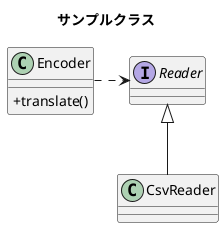
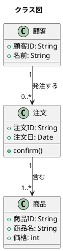
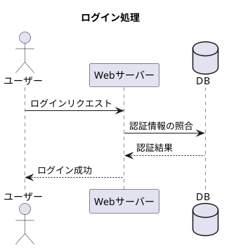
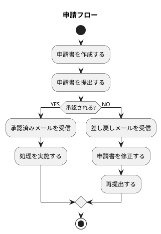
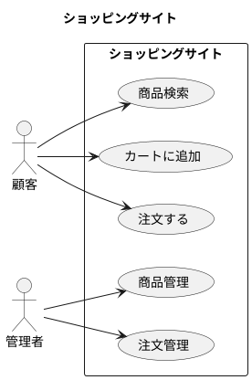
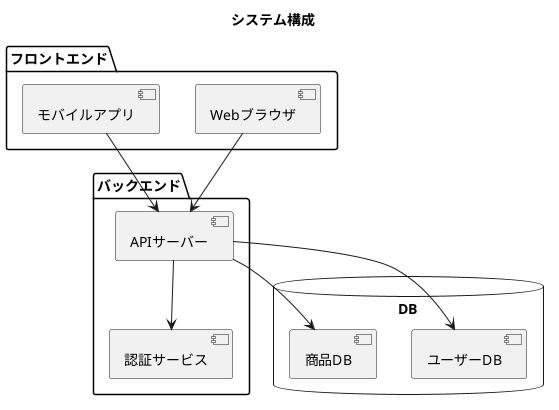
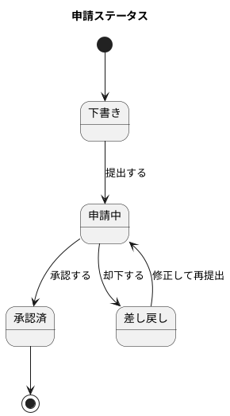
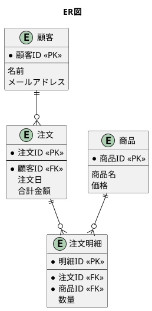
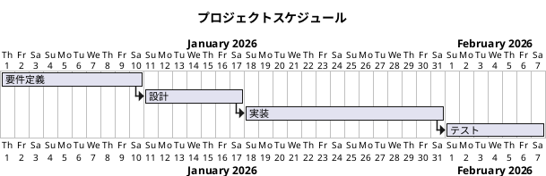
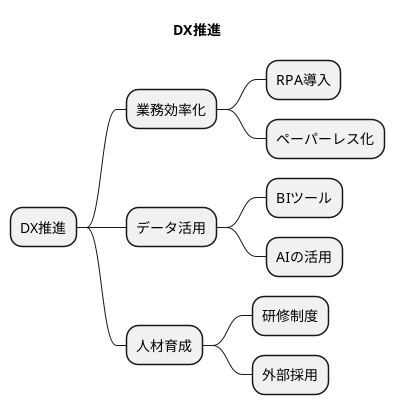

# PlantUML.md

**作成者**: gogo5nta  
**作成日**: 2026-06-24  
**目的**: PlantUMLで表現可能なMarkdownを整理
**バージョン**: v0.2  
**参考資料**:

| # | 資料名 | 備考 | URL |
|---|---|---|---|
| 1 | Mermaidで描ける図の種類と活用ガイド | Markdown × Mermaid | [URL](./Mermaidで描ける図の種類と活用ガイド_260624.md) |
| 2 | PlantUMLで描ける図の種類と活用ガイド | Markdown × PlantUML | [URL](./PlantUMLで描ける図の種類と活用ガイド_260624.md)

ベースファイル:
PlantUMLで描ける図の種類と活用ガイド_260624.md

---

# 0.事前設定

Windowsの場合

Step1: Graphvizのインストール
- PlantUMLはdotを使って図を作成するので、あらかじめGraphvizをインストールしておく必要がある。
- 以下URLから、stable版のインストーラをダウンロード＆インストールする。
  - https://www.graphviz.org/download/

<BR>

Step2: Javaのインストール
- OpenJDKを使う場合はこちらからダウンロード。
  - http://jdk.java.net/
    - https://www.oracle.com/jp/java/technologies/downloads/#jdk26-windows
- 環境変数の設定
  - dotコマンドが使えるように環境変数PATHに以下のパスを追加(デフォルトインストールの場合)
    - C:\Program Files\Graphviz\bin
  - PlantUMLはJavaを使うため、java.exeのパスも追加
    - C:\Program Files\Java\jdk-26.0.1\bin
  - 環境変数PLANTUML_LIMIT_SIZE=8192を設定
    - [参考URL](https://plantuml.com/ja/faq)
    - これはPlantUMLで大きな図を描くと途切れてしまう対策。

<BR>

Step3: Visual Studio Code用PlantUMLのインストール
- Visual Studio Codeで以下の機能拡張をインストール
  - PlantUML
    - https://marketplace.visualstudio.com/items?itemName=jebbs.plantuml
    - メモ : 
      - PlantUMLの公式サイトではplantuml.jarが配布されているが、この機能拡張にはplantuml.jarが同梱
      - Visual Studio CodeからPlantUMLを使う場合は、PlantUMLを別途インストールする必要はない

<BR>

Step4: VSCodeでプレビューを実施する場合
- Ctrl + ,を押してSettingsを開く
  - markdown-preview-enhanced.plantumlJarPath
    - plantuml.jarファイルのパスを設定
    - 例:
      - C:\Users\pinNo\.vscode\extensions\jebbs.plantuml-2.18.1\plantuml.jar

[参考_Visual Studio CodeでPlantUMLを使うメモ (Windows編).md](https://gist.github.com/yoggy/bd68b3f1f55dbd742bea71424ca66564)

[参考_Markdownの文書にPlantUMLを使ってUMLを埋め込む](https://qiita.com/ker38c/items/c51b780aeb6665a8a974)

[参考_VSCodeでMarkDownとPlantUMLを使う](https://zenn.dev/yuhati/articles/880396ce89e38e)

<BR>

Step5: Githubのリポジトリからブラウザ上でPlantUMLを表示(ブラウザ拡張機能利用)
- [GitHub の Markdown (GFM) でPlantUMLを表示するChrome拡張](https://dev.classmethod.jp/articles/chrome-extension-plantuml-in-github-markdown/)
- [Chrome拡張機能_Pegmatite](https://chromewebstore.google.com/detail/pegmatite/jegkfbnfbfnohncpcfcimepibmhlkldo)
  - **Chrome拡張機能_Pegmatiteをインストールすると、ブラウザ上でPlantUMLが図で表示**

---

# 1.サンプル例

サンプルクラス 図の出力：


コード例： ※埋め込み時は、#@startuml → @startuml
```text
#@startuml
skinparam classAttributeIconSize 0

title サンプルクラス

class Encoder{
    + translate()
}
Interface Reader
Reader <|-- CsvReader
Encoder .> Reader
@enduml
```

<BR>

---

# 2.クラス図（Class Diagram）

可視化できる情報： クラス構造、継承・依存関係、オブジェクト設計

クラス図 図の出力：


コード例： ※埋め込み時は、#@startuml → @startuml
```text
#@startuml
title クラス図

class 注文 {
    +注文ID: String
    +注文日: Date
    +confirm()
}
class 顧客 {
    +顧客ID: String
    +名前: String
}
class 商品 {
    +商品ID: String
    +商品名: String
    +価格: int
}
顧客 "1" --> "0..*" 注文 : 発注する
注文 "1" --> "1..*" 商品 : 含む
@enduml
```

<BR>

---

# 3.シーケンス図（Sequence Diagram）

可視化できる情報： システム間の通信順序、APIのやりとり、業務上の関係者間の処理フロー

シーケンス図 図の出力：


コード例： ※埋め込み時は、#@startuml → @startuml
```text
#@startuml
title ログイン処理

actor ユーザー
participant "Webサーバー" as Server
database "DB" as DB

ユーザー -> Server : ログインリクエスト
Server -> DB : 認証情報の照合
DB --> Server : 認証結果
Server --> ユーザー : ログイン成功
@enduml
```

<BR>

---

# 4.アクティビティ図（Activity Diagram）

可視化できる情報： 業務フロー、処理の分岐・並行処理、ワークフロー設計

アクティビティ図 図の出力：


コード例： ※埋め込み時は、#@startuml → @startuml
```text
#@startuml
title 申請フロー

start
:申請書を作成する;
:申請書を提出する;
if (承認される?) then (YES)
    :承認済みメールを受信;
    :処理を実施する;
else (NO)
    :差し戻しメールを受信;
    :申請書を修正する;
    :再提出する;
endif
stop
@enduml
```

<BR>

---

# 5.ユースケース図（Use Case Diagram）

可視化できる情報： システムの機能一覧、アクターとシステムの関係、要件整理

ユースケース図 図の出力：


コード例： ※埋め込み時は、#@startuml → @startuml
```text
#@startuml
title ショッピングサイト

left to right direction
actor 顧客
actor 管理者

rectangle ショッピングサイト {
    顧客 --> (商品検索)
    顧客 --> (カートに追加)
    顧客 --> (注文する)
    管理者 --> (商品管理)
    管理者 --> (注文管理)
}
@enduml
```

<BR>

---

# 6.コンポーネント図（Component Diagram）

可視化できる情報： システム構成、モジュール間の依存関係、アーキテクチャ設計

コンポーネント図 図の出力：


コード例： ※埋め込み時は、#@startuml → @startuml
```text
#@startuml
title システム構成

package "フロントエンド" {
    [Webブラウザ]
    [モバイルアプリ]
}
package "バックエンド" {
    [APIサーバー]
    [認証サービス]
}
database "DB" {
    [ユーザーDB]
    [商品DB]
}

[Webブラウザ] --> [APIサーバー]
[モバイルアプリ] --> [APIサーバー]
[APIサーバー] --> [認証サービス]
[APIサーバー] --> [ユーザーDB]
[APIサーバー] --> [商品DB]
@enduml
```

<BR>

---

# 7.状態遷移図（State Diagram）

可視化できる情報： ワークフローの状態変化、申請フローのステータス管理

状態遷移図 図の出力：


コード例： ※埋め込み時は、#@startuml → @startuml
```text
#@startuml
title 申請ステータス

[*] --> 下書き
下書き --> 申請中 : 提出する
申請中 --> 承認済 : 承認する
申請中 --> 差し戻し : 却下する
差し戻し --> 申請中 : 修正して再提出
承認済 --> [*]
@enduml
```

<BR>

---

# 8.ER図（Entity Relationship Diagram）

可視化できる情報： データベース設計、エンティティ間の関係、テーブル構造

ER図 図の出力：


コード例： ※埋め込み時は、#@startuml → @startuml
```text
#@startuml
title ER図

entity 顧客 {
    * 顧客ID <<PK>>
    --
    名前
    メールアドレス
}
entity 注文 {
    * 注文ID <<PK>>
    --
    * 顧客ID <<FK>>
    注文日
    合計金額
}
entity 商品 {
    * 商品ID <<PK>>
    --
    商品名
    価格
}
entity 注文明細 {
    * 明細ID <<PK>>
    --
    * 注文ID <<FK>>
    * 商品ID <<FK>>
    数量
}
顧客 ||--o{ 注文
注文 ||--o{ 注文明細
商品 ||--o{ 注文明細
@enduml
```

<BR>

---

# 9.ガントチャート（Gantt Chart）

可視化できる情報： プロジェクトスケジュール、タスクの依存関係、進捗管理

ガントチャート 図の出力：


コード例： ※埋め込み時は、#@startuml → @startuml
```text
#@startgantt
title プロジェクトスケジュール

Project starts 2026-01-01
[要件定義] lasts 10 days
[設計] lasts 7 days
[設計] starts at [要件定義]'s end
[実装] lasts 14 days
[実装] starts at [設計]'s end
[テスト] lasts 7 days
[テスト] starts at [実装]'s end
@endgantt
```

<BR>

---

# 10.マインドマップ（Mind Map）

可視化できる情報： アイデアの整理、課題の構造化、概念の階層関係

マインドマップ 図の出力：
整形有


整形無


コード例： ※埋め込み時は、#@startuml → @startuml
整形有
```text
#@startmindmap
title DX推進

* DX推進
 ** 業務効率化
  *** RPA導入
  *** ペーパーレス化
 ** データ活用
  *** BIツール
  *** AIの活用
 ** 人材育成
  *** 研修制度
  *** 外部採用
@endmindmap
```

コード例： ※埋め込み時は、#@startuml → @startuml
整形無
```text
#@startmindmap
title DX推進

* DX推進
** 業務効率化
*** RPA導入
*** ペーパーレス化
** データ活用
*** BIツール
*** AIの活用
** 人材育成
*** 研修制度
*** 外部採用
@endmindmap
```

<BR>

---

# 図の種類 早見表

| # | 図の種類 | 主な用途 | 向いているシーン |
|---|---|---|---|
| 1 | [サンプル例](#1サンプル例) | クラス図の基本 | 動作確認・学習用 |
| 2 | [クラス図](#2クラス図class-diagram) | クラス構造・継承関係 | システム設計書、オブジェクト設計 |
| 3 |  [シーケンス図](#3シーケンス図sequence-diagram) | 時系列のやりとり | システム設計、API仕様書 |
| 4 | [アクティビティ図](#4アクティビティ図activity-diagram) | 処理フロー・分岐 | 業務フロー整理、マニュアル作成 |
| 5 | [ユースケース図](#5ユースケース図use-case-diagram) | アクターと機能の関係 | 要件定義書、機能一覧 |
| 6 | [コンポーネント図](#6コンポーネント図component-diagram) | システム構成・依存関係 | アーキテクチャ設計書 |
| 7 | [状態遷移図](#7状態遷移図state-diagram) | ステータス変化 | 申請フロー、ワークフロー設計 |
| 8 | [ER図](#8er図entity-relationship-diagram) | データ構造・テーブル関係 | DB設計書、ER図 |
| 9 | [ガントチャート](#9ガントチャートgantt-chart) | スケジュール管理 | プロジェクト計画書 |
| 10 | [マインドマップ](#10マインドマップmind-map) | アイデア整理 | 企画立案、課題整理 |

<BR>
