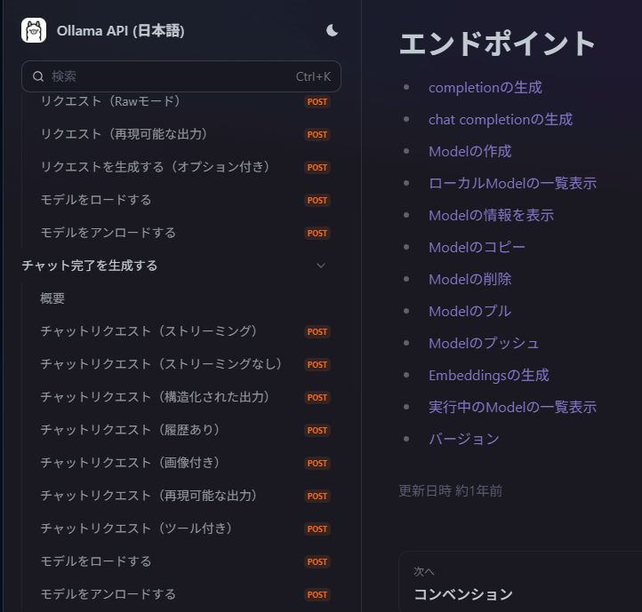
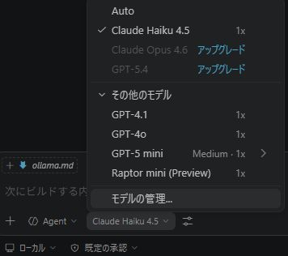
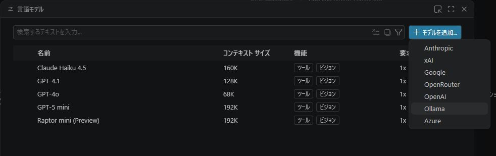
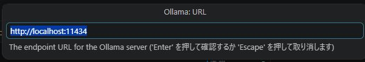
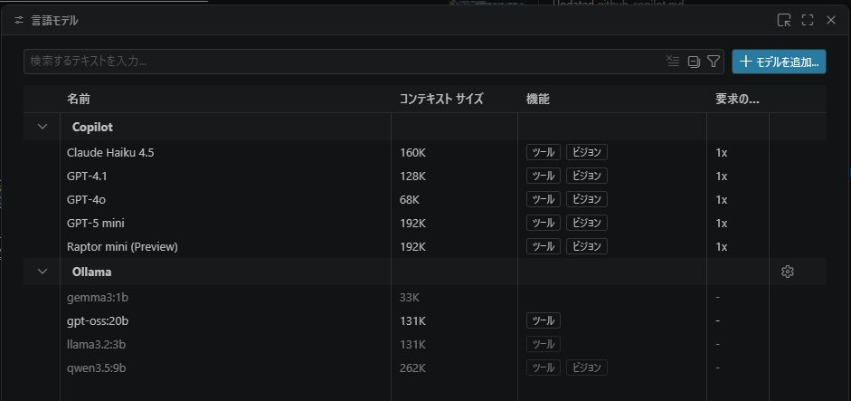

# ollama.md

ollama関係のメモ

**作成日**  : 2026/04/13
**ﾊﾞｰｼﾞｮﾝ** : v0.0.3

---

# Table of Contents

- [ollama.md](#ollamamd)
- [Table of Contents](#table-of-contents)
- [1. ollama docker設定](#1-ollama-docker設定)
  - [1.1 docker実行](#11-docker実行)
  - [1.2 GPUバックグランド実行](#12-gpuバックグランド実行)
    - [1.3 ollama起動確認](#13-ollama起動確認)
  - [1.4 モデルインストール](#14-モデルインストール)
    - [1.4.1 モデル確認(URL)](#141-モデル確認url)
    - [1.4.2 モデルインストール](#142-モデルインストール)
    - [1.4.3 モデル確認(local)](#143-モデル確認local)
  - [1.5 推論](#15-推論)
    - [1.5.1 推論(curl)](#151-推論curl)
    - [1.5.2 推論をjson形式で保存(curl)](#152-推論をjson形式で保存curl)
    - [1.5.3 ollamaの推論(terminal)](#153-ollamaの推論terminal)
  - [1.6 ollama API (日本語)](#16-ollama-api-日本語)
  - [1.7 ollama コマンド一覧](#17-ollama-コマンド一覧)
- [2. Ollama応用](#2-ollama応用)
  - [2.1 VSCode Github CopilotでOllama利用](#21-vscode-github-copilotでollama利用)
- [3. Ollamaモデルインストール(詳細)](#3-ollamaモデルインストール詳細)
  - [VRAM 12Gb (Geforce 3060 x1) 日本語おすすめ](#vram-12gb-geforce-3060-x1-日本語おすすめ)
    - [参考情報(VRAM 12GB)](#参考情報vram-12gb)
  - [VRAM 24Gb (Geforce 3060 x2) 日本語おすすめ](#vram-24gb-geforce-3060-x2-日本語おすすめ)
    - [1. おすすめの日本語対応モデル (24GB VRAM)](#1-おすすめの日本語対応モデル-24gb-vram)
    - [2. Geforce3060 x 2のModelfile例 (24GB VRAM)](#2-geforce3060-x-2のmodelfile例-24gb-vram)
  - [【NG】LLM-jp-4 32B-A3Bのインストール (うまく行かなかった)](#ngllm-jp-4-32b-a3bのインストール-うまく行かなかった)
      - [概要](#概要)
    - [1. LLM-jp-4 32B-A3B の特徴](#1-llm-jp-4-32b-a3b-の特徴)
    - [2. Ollamaでの実行方法(日本語が文字化け)](#2-ollamaでの実行方法日本語が文字化け)
    - [2. Ollamaでの実行方法(別方法)](#2-ollamaでの実行方法別方法)
    - [3. 動作環境・動作速度](#3-動作環境動作速度)
    - [4. 関連リンク](#4-関連リンク)
    - [5. VSCodeで連携する場合](#5-vscodeで連携する場合)
      - [5.1 VSCodeの「Continue」拡張機能に追加](#51-vscodeのcontinue拡張機能に追加)
---

# 1. ollama docker設定

## 1.1 docker実行

[参考 1_Docker を用いた Ollama の実行手順まとめ](https://qiita.com/Chi_corp_123/items/7b3e2617e901a656ede4){: .anchor}
[参考 2_Docker 上で GPU を使って Ollama を動かす](https://ishikawa-pro.hatenablog.com/entry/2025/01/16/192126){: .anchor}

<details>
  <summary>フォルダマウントの注意をクリックで展開</summary>

```text
Dockerコマンドで -v ollama:/root/.ollama と指定した場合、
「名前付きボリューム（Named Volume）」として扱われるため、
ホスト側のカレントディレクトリ（今いるフォルダ）にデータは現れません。 

フォルダが見当たらない主な理由と、解決策を整理しました。
1. なぜフォルダが見えないのか？
名前付きボリュームの仕組み: ollama: のようにコロンの左側に
絶対パス（/から始まるパス）を書かない場合、Dockerが管理する専用領域にデータが保存されます。

保存場所: 通常、Linux環境では /var/lib/docker/volumes/ollama/_data に保存されています。ここは管理者権限がないとアクセスできません。

2. ホスト側のフォルダで見えるようにする方法（バインドマウント）
自分の好きなフォルダ（例：デスクトップや作業用ディレクトリ）の中身を見たい場合は、
絶対パスで指定する必要があります。

実行コマンド例（Linux / Mac）
カレントディレクトリの ollama_data フォルダを同期させる場合：

bash
docker run -d --gpus=all -v /home/$USER/ollama:/root/.ollama -p 11434:11434 --name ollama ollama/ollama
```

</details>

<BR>

基本実行は以下。　　
ollamaのイメージを取得、 .ollamaフォルダをマウント、ollamaのコンテナ名で実行
初回はイメージ取得で3.5GB程度使用

```bash
# docker 基本起動
docker run -d -v ollama:/root/.ollama -p 11434:11434 --name ollama ollama/ollama
```

## 1.2 GPUバックグランド実行

GPUでバックグラウンド動作

```bash
# docker 基本起動(GPU)
docker run -d --gpus=all -v ollama:/root/.ollama -p 11434:11434 --name ollama ollama/ollama
```

GPUでバックグラウンド動作(home環境にバインド)

```bash
# docker 基本起動(GPU) home環境にバインド
docker run -d --gpus=all -v /home/$USER/ollama:/root/.ollama -p 11434:11434 --name ollama ollama/ollama
```

```bash
# docker 基本起動(GPU) home環境にバインド
docker run -d \
  --gpus=all \
  -v /home/$USER/ollama:/root/.ollama \
  -p 11434:11434 \
  --restart always \
  --name ollama ollama/ollama
```

<BR>

start_ollama.shの例(chmod +xで実行権限を与えておく)

```bash
#!/bin/bash

# docker 基本起動(GPU) home環境にバインド
docker run -d \
  --gpus=all \
  -v /home/$USER/ollama:/root/.ollama \
  -p 11434:11434 \
  --restart always \
  --name ollama ollama/ollama
```

### 1.3 ollama起動確認

curlを使い、以下のコマンドで確認可能

```bash
# curlコマンドで動作確認
curl http://localhost:11434
```

```bash
# curlコマンドで動作確認
curl http://192.168.1.61:11434
```

正常動作の場合、以下のメッセージを取得

```bash
Ollama is running
```

## 1.4 モデルインストール

### 1.4.1 モデル確認(URL)

インストール可能なモデル一覧は以下のURLを参考
https://ollama.com/library

### 1.4.2 モデルインストール

docker実行例:

```bash
docker exec -it ollama ollama pull qwen3.5:9b
```

```bash
docker exec -it ollama ollama pull gpt-oss:20b
```

### 1.4.3 モデル確認(local)

以下のコマンドで、localにインストールしたモデル一覧を確認

docker実行例:

```bash
# ollama listでインストールモデルを確認
docker exec -it ollama ollama list
```

curl確認

```bash
# curlでインストールモデルを確認
curl http://localhost:11434/api/tags
```

curl確認 (IP)

```bash
# curlでインストールモデルを確認
curl http://192.168.1.61:11434/api/tags
```

実行中のモデル curl確認 (IP)

```bash
# curlで実行中モデルを確認
curl http://192.168.1.61:11434/api/ps
```

<BR>

curl出力のjsonをjqで成形 (モデル一覧)

```bash
# bashでjqを用いて成形
curl http://localhost:11434/api/tags | jq -C '.'
```

## 1.5 推論

### 1.5.1 推論(curl)

curl出力のjsonをjqで成形(chat結果)

```bash
# curlを使い、chat API経由で推論実施
curl http://localhost:11434/api/chat -d '{
  "model": "qwen3.5:9b",
  "messages": [{
    "role": "user",
    "content": "日本語で挨拶して"
  }],
  "stream": false
}' | jq -C
```

<BR>

ollama出力をjsonファイルに保存

```bash
# curlを使い、chat API経由で推論実施
curl http://localhost:11434/api/chat -d '{
  "model": "qwen3.5:9b",
  "messages": [{
    "role": "user",
    "content": "日本語で挨拶して"
  }],
  "stream": false
}' > ollama_res.json
```

### 1.5.2 推論をjson形式で保存(curl)

ollama出力をjsonファイルに保存　(qwen3 no-thinking)
[参考:extra_bodyでno_thinking](https://github.com/run-llama/llama_index/issues/18635#issuecomment-3686160674)

```bash
# curlを使いno-thinkingの出力を保存
curl http://localhost:11434/api/chat -d '{
  "model": "qwen3.5:9b",
  "messages": [{
    "role": "user",
    "content": "日本語で挨拶して"
  }],
  "extra_body": {
    "chat_template_kwargs": {"enable_thinking": false}
  },
  "stream": false
}' > ollama_res_nothinking.json
```

<BR>

jqでollama出力を解析

```bash
# jqでresponse[message[content]]を成形し確認
cat ollama_res.json | jq '.message.content'
```

### 1.5.3 ollamaの推論(terminal)

軽いモデルをダウンロード

```bash
ollama pull gemma3:1b
```

<BR>

teminal上で実行 ollama runを実行

```bash
ollama run gemma3:1b
```

ollama run後の、質問と応答は以下

```bash
>>> 挨拶して
こんにちは！何かお手伝いできることはありますか？ 😊
```

## 1.6 ollama API (日本語)

[Ollama API (日本語)](https://ollama-jp.apidog.io/)


<BR>

## 1.7 ollama コマンド一覧

| コマンド | 説明 |
| --- | --- |
| ollama run <モデル名>	   | モデルをダウンロード（未入手の場合）し、チャットを開始 |
| ollama list (または ls)	 | ローカルにインストール済みのモデル一覧を表示 |
| ollama pull <モデル名>	 | リモートライブラリからモデルをダウンロード（プル） |
| ollama rm <モデル名>	   | ローカルのモデルを削除 |
| ollama push <モデル名>	 | ライブラリにモデルをアップロード |
| ollama serve	          | Ollamaサーバーを起動する（通常は自動） |
| ollama create <名> -f <ファイル>	|  Modelfileから新しいモデルを作成<BR>ollama create my-llm-jp-4 -f llm-jp-4-32b.Modelfile |
| ollama cp <元> <新>	    | モデルをコピー |
| ollama show <モデル名>	| モデルの詳細情報（Modelfile、パラメータ等）を表示 |

---

# 2. Ollama応用

## 2.1 VSCode Github CopilotでOllama利用

[参考1_VSCode - GitHub CopilotをローカルLLMで動かしてみた(Ollama, gpt-oss:20b)](https://zenn.dev/okyugog/articles/6666289d84fed6)

<BR>

1. vscodeのGithub Copilotのチャットで、もdるの管理を選択


2. ＋モデルを追加でollamaを選択


3. OllamaのURLを記入


 | URL | 備考 |
 |-----|------|
 | http://localhost:11434 | localhost(同じPC)の場合 |
 | http://192.168.1.61:11434 | 他のPCの場合 |

4. Ollamaのモデルが表示されるようにollama内モデルを修正


<BR>

---

# 3. Ollamaモデルインストール(詳細)

## VRAM 12Gb (Geforce 3060 x1) 日本語おすすめ

| モデル | 特徴 | Ollama コマンド |
|---|---|---|
| Gemma4 | Googleが2026年にリリース| ollama run gemma4:e2b<BR>ollama run gemma4:e4b<BR>ollama run gemma4:26b |
| Qwenb3.5 | バランスが良い | ollama run qwen3.5:4b<BR>ollama run qwen3.5:9b |
| qwen2.5-coder:7b | コーディング向け | ollama run qwen2.5-coder:7b |

<BR>

### 参考情報(VRAM 12GB)

| 環境 | 説明 | URL |
| --- | --- | --- |
| MacBook (16GB) | Gemma 4をローカル実行 | https://dev.classmethod.jp/articles/run-gemma4-locally-on-macbook-with-ollama/ |
| DGX Spark | Gemma 4 vs Qwen 3.5 MoEモデル対決ベンチマーク | https://qiita.com/nabe2030/items/fc3db819470edcca5aee |
| 筆者のおすすめ | ローカルLLMランキング①【2026年版】 | https://note.com/catap_art3d/n/nacce52421e4a |
| ローカルLLM整理1 | 2026年のローカルLLM事情を整理 | https://dev.classmethod.jp/articles/local-llm-guide-2026/ |

## VRAM 24Gb (Geforce 3060 x2) 日本語おすすめ

###  1. おすすめの日本語対応モデル (24GB VRAM)

VRAM 24GBでコーディング能力と日本語対応のバランスが良いモデルは以下の通りです。  

| モデル | 特徴 | Ollama コマンド |
|---|---|---|
| Qwen2.5-Coder-32B-Instruct (おすすめ) | 現時点でローカルコーディングにおける最高峰モデルの一つ。32Bパラメータあるが、Q4_K_Mなどの量子化を行えば24GB VRAMに収まる。日本語の理解力が高く、コード生成の質も非常に高い。 | ollama run qwen2.5-coder:32b |
| Qwen2.5-14B-Instruct | 32Bよりも動作が軽快。コーディング性能も十分に高い。 | ollama run qwen2.5:14b |
| Llama-3-ELYZA-JP-8B | 日本語に特化した8Bモデル。軽量で高速。コンテキストの長さや、より深いコーディング知識が必要ない場合の対話・コード記述用。 | ollama run llama3-elyza |

<BR>

| サイト | 備考 | URL |
| --- | --- | --- |
| Qwen2.5-CoderをOllama＋Clineで試す | 環境はUbuntu 22.04 + RTX4090（VRAM24GB） | https://zenn.dev/kun432/scraps/f87398fffd51a7 |
| 2026 年に 24 GB の VRAM でローカルに実行するのに最適な汎用モデルは | このサイズのセグメントは Qwen3 (30B-A3B、VL-32B、32B など) が主流<BR>現時点では、一般的なチャットボット アシスタントには gemma がおそらく最良の選択 | https://www.reddit.com/r/LocalLLaMA/comments/1qlwibf/what_is_the_best_generalpurpose_model_to_run/?tl=ja#:~:text=16GB%20VRAM%E3%81%AE%E3%81%9F%E3%82%81%E3%81%AE%E3%83%99%E3%82%B9%E3%83%88%E3%83%A2%E3%83%87%E3%83%AB |
| 【RTX3060×2】Gemma4 26B A4Bを使ってみた話⑤【ollama】 | ollamaでGemma4:26bをGeforce3060x2で利用 | https://note.com/catap_art3d/n/n7a8dceaa5f48 |

<BR>

### 2. Geforce3060 x 2のModelfile例 (24GB VRAM)

```docker
# ベースモデルの指定（GGUF等のパスまたはリポジトリ名）
# FROM gemma4:26b-a4b-q4_K_M
FROM gemma4:26b

# パラメータ設定：GPUへのレイヤー割り当てを最大化
PARAMETER num_gpu 99

# コンテキストサイズの設定（VRAM 24GBなら32k〜128k程度まで実用圏内）
# 256kまで広げる場合は、KVキャッシュ圧縮設定等の調整を推奨
PARAMETER num_ctx 32768

# 推論の多様性と安定性のバランス
PARAMETER temperature 0.7
PARAMETER top_p 0.9
PARAMETER repeat_penalty 1.1

# システムプロンプト（日本語性能を最大限引き出す設定）
SYSTEM """
あなたは誠実で優秀な日本人のアシスタントです。
簡潔かつ論理的に、ユーザーの質問に日本語で回答してください。
"""
```

<BR>

以下のコマンドで、ollama create実行
``` bash
ollama create gemma4_26b_custum -f gemma4_26b_custum.Modelfile
```

## 【NG】LLM-jp-4 32B-A3Bのインストール (うまく行かなかった)

#### 概要

国立情報学研究所（NII）の大規模言語モデル研究開発センター（LLMC）が2026年4月3日に公開した「LLM-jp-4 32B-A3B」は、約320億パラメータを持つMoE（Mixture of Experts）アーキテクチャの国産LLMです。  
https://www.nii.ac.jp/news/release/2026/0403.html

このモデルは、Qwen3 MoE系アーキテクチャを採用しており、高品質なデータ（約12兆トークン）で学習されています。Ollamaを利用してローカル環境で動かすことが可能です。  

### 1. LLM-jp-4 32B-A3B の特徴

- モデル構成: 32B-A3B (MoE: Mixture of Experts)  
- 学習データ: 約12兆トークンの良質な日本語および英語コーパス  
- 性能: 日本語MT-Benchで強力な多言語LLM（GPT-4oやQwen3-8Bなど）を上回る性能を記録  
- context length: 最大約6万5千トークンの入出力に対応  

### 2. Ollamaでの実行方法(日本語が文字化け)
Hugging Face上のコミュニティや個人によって、Ollama形式（GGUF）のモデルが公開されています。  
https://huggingface.co/models?apps=ollama&other=base_model:quantized:llm-jp/llm-jp-4-32b-a3b-thinking  

- 推奨モデル名（Hugging Face）: alfredplpl/llm-jp-4-32b-a3b-thinking-gguf など
- Ollama実行コマンド例:

```bash
ollama run hf.co/alfredplpl/llm-jp-4-32b-a3b-thinking-gguf
```

※モデルのバージョンや量子化手法により名前が異なる場合があります

### 2. Ollamaでの実行方法(別方法)


Modelファイルを作成  
例: llm-jp-4-32b.Modelfile

```dockerfile
FROM hf.co/alfredplpl/llm-jp-4-32b-a3b-thinking-gguf:latest

# 日本語プロンプトテンプレートの追加（例）
TEMPLATE """{{ if .System }}<|im_start|>system
{{ .System }}<|im_end|>
{{ end }}{{ if .Prompt }}<|im_start|>user
{{ .Prompt }}<|im_end|>
{{ end }}<|im_start|>assistant
{{ .Response }}<|im_end|>
"""

# パラメータ設定
PARAMETER stop "<|im_start|>"
PARAMETER stop "<|im_end|>"
PARAMETER top_p 0.95
PARAMETER temperature 0.7
```

以下のコマンド等でollamaのdocker内のbashに移動
```bash
docker exec -it ollama bash
```

以下のコマンドで、ollama create実行
``` bash
ollama create my-llm-jp-4 -f llm-jp-4-32b.Modelfile
```

ollama listの実行結果
```bash
NAME                                                      ID              SIZE      MODIFIED          
my-llm-jp-4:latest                                        32f803b9bc3f    21 GB     4 minutes ago        
hf.co/alfredplpl/llm-jp-4-32b-a3b-thinking-gguf:latest    2e4199e0f4af    21 GB     About an hour ago    
llama3.2:3b                                               a80c4f17acd5    2.0 GB    7 days ago           
gemma3:1b                                                 8648f39daa8f    815 MB    7 days ago           
gpt-oss:20b                                               17052f91a42e    13 GB     7 days ago           
qwen3.5:9b                                                6488c96fa5fa    6.6 GB    7 days ago   
```

<BR>

- 参考
  - Ollamaのmodelfileの詳細メモ
    - https://qiita.com/kiyotaman/items/2effed548e7be32da546
  - 

### 3. 動作環境・動作速度

32Bモデルですが、MoEモデルであるため実行時のメモリ使用量は全結合モデルより抑えられる傾向にあります。  
- 動作報告: RTX 4060 Ti (16GB VRAM) で動作報告あり。  
- 速度: RTX 4060 Tiで約42 tok/sec（トークン/秒）を記録。  
- 必要スペック: 最低でも16GB以上のVRAMを持つGPUか、十分なメインメモリ（32GB以上推奨）が必要。  

### 4. 関連リンク
- Hugging Face (LLM-jp): llm-jp/llm-jp-4-32b-a3b-base
  - https://huggingface.co/models?apps=ollama&other=base_model:quantized:llm-jp/llm-jp-4-32b-a3b-thinking
- 公式ニュース: NIIプレスリリース
  - https://www.nii.ac.jp/news/release/2026/0403.html
- 日本語向けのNLPに関する、Pythonライブラリ、LLM、辞書、コーパスに特化したリソース
  - https://github.com/taishi-i/awesome-japanese-nlp-resources/blob/main/docs/huggingface.ja.md

最新の国産モデルとして高い日本語理解能力が期待されており、Ollamaで手軽に検証できます。

### 5. VSCodeで連携する場合

#### 5.1 VSCodeの「Continue」拡張機能に追加

VSCodeでGitHub Copilotに近い体験をローカルモデルで実現するには、オープンソースの拡張機能 Continue を使用します。  

- 1.インストール:
  - VSCodeの拡張機能マーケットプレイスから Continue をインストール

- 2.設定の編集:
  - Continueのサイドバーにある歯車アイコン（Open Config）をクリックし、config.json を開きます。

- 3.モデル情報の追加:
  - models 配列にOllamaの設定を追記
  - path: C:\Users\$USER\.continue\config.yaml

```yaml
name: Local Assistant
version: 1.0.0
schema: v1
models:
  - name: Llama 3.2 3B
    provider: ollama
    model: llama3.2:3b
    roles:
      - chat
      - edit
    apiBase: http://192.168.1.61:11434

  - name: Qwen3.5-Coder 9B
    provider: ollama
    model: qwen3.5:9b
    roles:
      - autocomplete
    apiBase: http://192.168.1.61:11434

  - name: llm-jp-4-32b-a3b-thinking-gguf
    provider: ollama
    model: hf.co/alfredplpl/llm-jp-4-32b-a3b-thinking-gguf:latest
    roles:
      - chat
      - edit
    apiBase: http://192.168.1.61:11434

context:
  - provider: code
  - provider: docs
  - provider: diff
  - provider: terminal
  - provider: problems
  - provider: folder
  - provider: codebase
```

- 4.使用開始:
  - Continueのチャット画面で、追加したモデル（LLM-jp-4）を選択して利用

- 5.参考
  - 【Windows】VSCodeと拡張機能Continueでollamaにローカル接続
    - https://www.kotememo.com/posts/vscode_ollama_continue
  - Ollama + ContinueでVS CodeにローカルLLM開発環境を構築する (Windows / WSL両対応)
    - https://qiita.com/usxc/items/72c9dd16a261fc502f90

