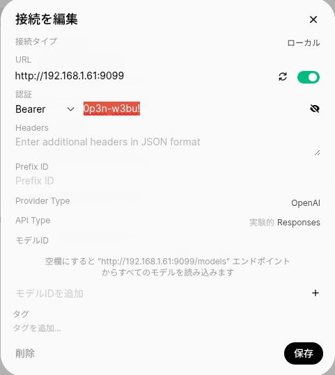
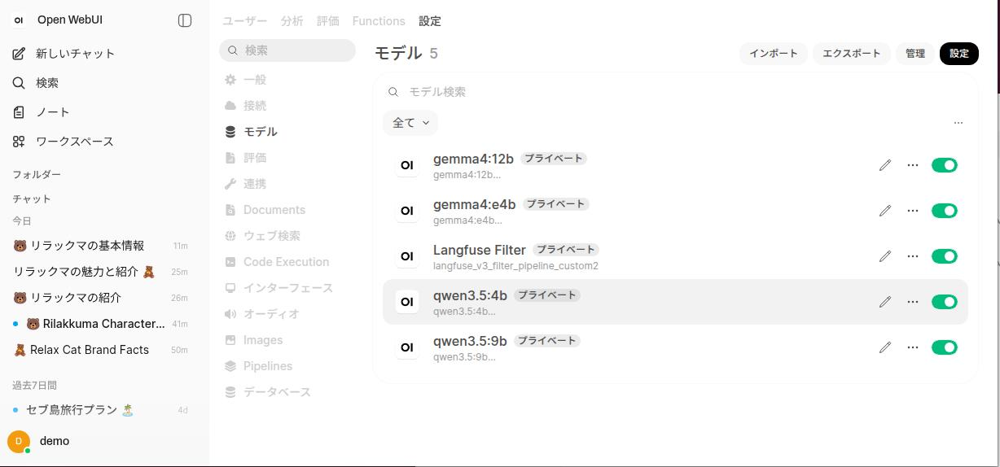
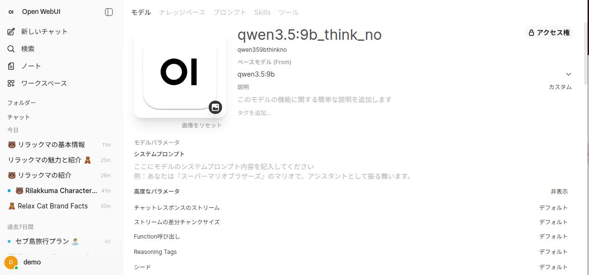
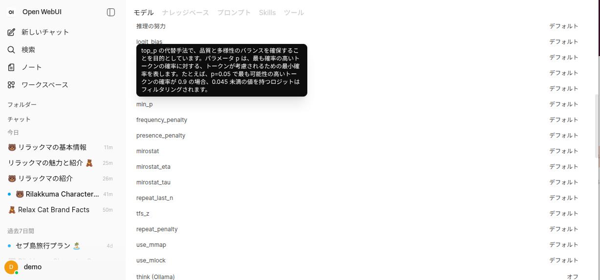
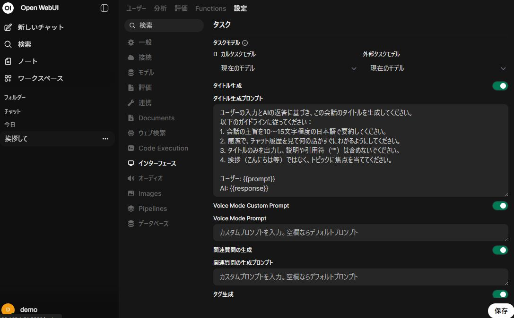

# openwebui.md

ollama関係のメモ

**作成日**  : 2026/06/14
**ﾊﾞｰｼﾞｮﾝ** : v0.0.4

---

## Table of Contents

| # | セクション | 説明 |
|---|---|---|
| 1 | [1. openwebui docker設定](#1-openwebui-docker設定) | Docker設定 |
| 1.1 | [1.1 docker実行(open-webui本体)](#11-docker実行open-webui本体) | docker実行 |
| 1.2 | [1.2 piplies起動（Openwebuiとは別に起動)](#12-piplies起動openwebuiとは別に起動) | piplies起動 |
| 1.3 | [1.3 piplinesをOpenWebUIに登録](#13-piplinesをOpenWebUIに登録) | piplines登録 |
| 1.4 | [1.4 Langfuse_V3用ファイル準備](#14-langfuse_v3用ファイル準備) | ファイル準備 |
| 1.4.1 | [1.4.1 Langufse_V3用フィルタカスタマイズ](#141-langufse_v3用フィルタカスタマイズ) | フィルタカスタマイズ |
| 1.5 | [1.5 OpenWebUIで推論をOff (think:off)](#15-openwebuiで推論をoff-thinkoff) | 推論Off |
| 2 | [2. openwebui設定](#2-openwebui設定) | 設定 |
| 2.1 | [2.1 タイトルを日本語で生成](#21-タイトルを日本語で生成) | タイトル生成 |

# 1. openwebui docker設定

## 1.1 docker実行(open-webui本体)

[参考1: ローカル環境で動かすOpen WebUIのインストールと使用方法](https://note.com/tamo2918/n/n94b8561fb70c)
[参考2: OpenWebUI Quick Start](https://docs.openwebui.com/getting-started/quick-start/)
[参考3: OllamaをDockerで動かす完全ガイド](https://saiteki-ai.com/basics/ai-tool/ollama/ollama-docker/)

基本実行は以下。　　
openwebuiのイメージを取得、 open-webuiフォルダをマウント、open-webuiのコンテナ名で実行
初回はイメージ取得で1GB程度使用

```bash
# docker 基本起動
docker run -d -v open-webui:/app/backend/data -p 3000:8080 -e OLLAMA_BASE_URL=http://localhost:11434 --name open-webui ghcr.io/open-webui/open-webui:main
```

```bash
# docker 基本起動 home環境にバインド 再起動
docker run -d -v /home/$USER/open-webui:/app/backend/data -p 3000:8080 -e OLLAMA_BASE_URL=http://192.168.1.61:11434 --name open-webui ghcr.io/open-webui/open-webui:main --restart=always
```

<BR>

sh_sample/open-webui_start.sh
**chmod +xで実行権限付与**

```bash
#!/bin/sh

# docker 基本起動(GPU) home環境(.ollama)にバインド＆コンテナ自動起動 & devモード
docker run -d \
  -v /home/$USER/open-webui:/app/backend/data \
  -p 3000:8080 \
  -e OLLAMA_BASE_URL=http://192.168.1.7:11434 \
  -e ENV=dev \
  --name open-webui \
  --restart=always \
  ghcr.io/open-webui/open-webui:main
```

<BR>

Swagger UI API ドキュメントを見る場合、以下を参考に
- [APIエンドポイントについて](https://www.reddit.com/r/OpenWebUI/comments/1k0vyyl/about_api_endpoints/?tl=ja)
- [After adding the environment variable -e ENV=dev](https://github.com/open-webui/open-webui/issues/18882)

```bash
# Swagger UI API  起動時に-e ENV=dev必要
http://localhost:11434/docs
```

# 1.2 piplies起動（Openwebuiとは別に起動)

OpenWebUIのpiplines有効は、以下を参照
- [LangfuseとOpenWebUIを統合する方法](https://langfuse.com/integrations/no-code/openwebui)
- [パイプライン：UIに依存しないOpenAI APIプラグインフレームワーク](https://docs.openwebui.com/features/extensibility/pipelines/)

```bash
# docker 基本起動 home環境にバインド_debug_piplines
docker run -d \
  -v /home/$USER/pipelines:/app/pipelines \
  -p 9099:9099 \
   --add-host=host.docker.internal:host-gateway  \
  -e PIPELINES_API_KEY=0p3n-w3bu! \
  --name open-webui-pipelines \
  --restart always \
  ghcr.io/open-webui/pipelines:main
```

<BR>

sh_sample/piplines_start.sh
**chmod +xで実行権限付与**

```bash
#!/bin/bash

# docker 基本起動 home環境にバインド_debug_piplines
docker run -d \
  -v /home/$USER/pipelines:/app/pipelines \
  -p 9099:9099 \
   --add-host=host.docker.internal:host-gateway  \
  -e PIPELINES_API_KEY=0p3n-w3bu! \
  --name open-webui-pipelines \
  --restart always \
  ghcr.io/open-webui/pipelines:main
```

# 1.3 piplinesをOpenWebUIに登録

OpenWebUIに管理者でログイン > 管理者パネル > 設定 > 接続  
OpenAI API接続の管理の「＋」を押して、以下の入力。piplines  
への接続が可能になる。

| 内容 | 値 | 備考 |
| --- | --- | --- |
| URL | http://192.168.1.7:9099 | ※localhostではNG。IP固定 |
| API-KEY | 0p3n-w3bu! | |
| API-Type | Respnones | |

  - 

# 1.4 Langfuse_V3用ファイル準備

- [langfuse_v3_filter_pipeline.py](https://github.com/open-webui/pipelines/blob/main/examples/filters/langfuse_v3_filter_pipeline.py)
- [解説HP](https://langfuse.com/integrations/no-code/openwebui)

langfuse_v3_filter_pipeline.pyを入手し、
/home/$USER/piplines のフォルダに格納

or [1.3](#13-piplinesをopenwebuiに登録)設定後に、管理者パネル > 設定 > piplinesを選択し、Github URLからインストールでpiplineのファイル(python)があるURLを入力。以下を設定し保存を押す

| 内容 | 値 | 備考 |
| --- | --- | --- |
| Secret Key | xxx | LangfuseでKEY発行 |
| Public Key | xxx | LangfuseでKEY発行 |
| Host | http://192.168.1.7:3001 | LangfuseのURL |
| Debug | 有効 | 念の為 On |
<BR>

## 1.4.1 Langufse_V3用フィルタカスタマイズ

[Github_langfuse_v3_filter_pipeline_custom2.py](https://github.com/gogo5nta/Ubuntu2404_public/blob/main/docs/sample/langfuse_v3_filter_pipeline_custom2.py)からファイルを追加。

--- Add 2026-06-14 ---
- Traceの出力を以下に修正
  - Name: OpenWebUIのモデル名-セッションID
  - Input: ユーザーの質問文
  - Output: OpenWebUIの回答文

<BR>

# 1.5 OpenWebUIで推論をOff (think:off)

ollamaでサポートしている方法として、管理者パネル > 設定 > モデルを選択。推論をOff(think:off)したいモデルを選んで、  
  - 
<BR>

クローン > 詳細パラメータのthinkをなしに変更
  - 
  - 
<BR>

---

# 2. openwebui設定

## 2.1 タイトルを日本語で生成

Step1: OpenWebUI 画面左下のプロファイル > 管理者パネル > 設定 > インタフェース
Step2: タイトル生成プロンプトに以下を入れる
```text
ユーザーの入力とAIの返答に基づき、この会話のタイトルを生成してください。
以下のガイドラインに従ってください：
1. 会話の主旨を10〜15文字程度の日本語で要約してください。
2. 簡潔で、チャット履歴を見て何の話かすぐにわかるようにしてください。
3. タイトルのみを出力し、説明や引用符（""）は含めないでください。
4. 挨拶（こんにちは等）ではなく、トピックに焦点を当ててください。

ユーザー: {{prompt}}
AI: {{response}}
```

- 
